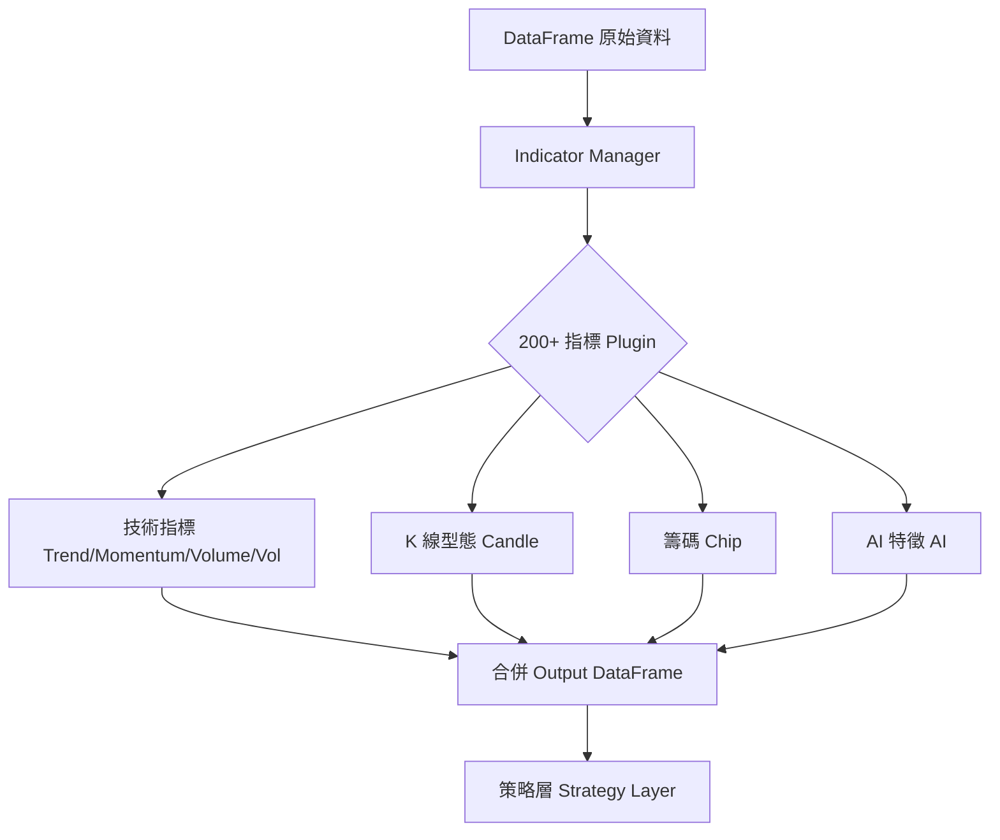

# 📘 **TAITS S1 OFFICIAL WHITEPAPER（CHAPTER 4/15）**

# **CHAPTER 4 — FEATURE LAYER（指標層 · 200+ 指標 · 世界級 Plugin 架構）**

**（TAITS S1 超核心章 · 指標 / 特徵工程 / GMMA / 籌碼 / K 線 / 纏論 / AI 特徵）**

> ⚠️ TAITS S1 的 Feature Layer（指標層）等同於整套系統的「技術大腦」。
>
> 如果 Data Layer 是血液，
> **Feature Layer 就是“神經系統”**。
>
> **這章非常巨大、精雕細琢，適合放在獨立白皮書中。**

本章包含：

1. Feature Layer 目的與核心設計
2. 指標分類（Trend/Momentum/Volume/Volatility/Candle/Chip/AI）
3. TAITS 專用指標（GMMA、CBL、纏論分型、壓力/支撐自動化）
4. 指標管理器（Indicator Manager）
5. 全部 200+ 指標清單
6. 計算示意圖
7. Feature Pipeline（最終整合流程）

---

# # 🔷 **4.1 Feature Layer（指標層）目的**

TAITS S1 的指標層有三大目標：

### **① 把「原始資料」→ 轉換成「可用訊號」**

例如：

| 原始資料                | 指標轉換後                         |
| ------------------- | ----------------------------- |
| Open/High/Low/Close | SMA20 / EMA60 / GMMA…         |
| 新聞內容                | NLP Sentiment Score           |
| 籌碼數據                | 外資 5 日淨買超、主力集中度               |
| K 線形態               | Hammer、Engulfing、Morning Star |
| AI 模型輸出             | Trend Prob / Fakeout Prob     |

---

### **② 全部指標模組化（可 plugin / 可擴充）**

每一個指標是一個：

```
/indicators/{category}/{indicator_name}.py
```

例如：

```
/indicators/trend/ema.py
/indicators/trend/gmma.py
/indicators/volatility/atr.py
/indicators/chip/foreign_buyer.py
/indicators/candle/engulfing.py
```

---

### **③ 指標輸出統一為 DataFrame 欄位**

例如：

```
ema_20
gmma_fast_avg
rsi_14
atr_14
bb_upper
chip_foreign_5d
sentiment_score
ai_kronos_trend
```

---

# # 🔷 **4.2 指標分類（TAITS S1 官方標準 7 大類）**

TAITS 分為 **7 類、200+ 指標**：

| 類別                  | 指標數量 | 說明                      |
| ------------------- | ---- | ----------------------- |
| 1. 趨勢指標 Trend       | 40   | MA、EMA、GMMA、MACD、ADX    |
| 2. 動能指標 Momentum    | 30   | RSI、Stoch、ROC…          |
| 3. 波動指標 Volatility  | 20   | ATR、HV、BB、KC            |
| 4. 量能指標 Volume      | 25   | OBV、Volume Spike、A/D    |
| 5. K 線形態 Candle     | 40   | 錘子線、吞噬、星線、NR7…          |
| 6. 籌碼指標 Chip        | 25   | 外資、投信、自營、集中度            |
| 7. AI 特徵 AI Feature | 20   | LSTM、Transformer、Kronos |

---

# # 🔷 **4.3 趨勢指標（Trend Indicators）**

最重要的分類，TAITS S1 有 **40+ 個趨勢指標**。

## **4.3.1 MA 系列（基本均線）**

```
sma_5
sma_10
sma_20
sma_60
sma_120
sma_240
```

## **4.3.2 EMA 系列（平滑均線）**

```
ema_5
ema_10
ema_20
ema_60
ema_120
```

## **4.3.3 WMA/HMA**

* WMA20
* HMA20（赫爾均線，低滯後）

## **4.3.4 DEMA/TEMA/ZLEMA**

* DEMA20
* TEMA20
* ZLEMA20（去滯後均線，短線非常強）

---

## **4.3.5 GMMA（顧比均線 · TAITS 核心指標）**

顧比快速組：

```
ema3, ema5, ema8, ema10, ema12, ema15
```

顧比慢速組：

```
ema30, ema35, ema40, ema45, ema50, ema60
```

TAITS 提供：

```
gmma_fast_avg
gmma_slow_avg
gmma_spread
gmma_trend_strength
```

---

## **4.3.6 顧比倒數線 CBL（Count Back Line）**

TAITS S1 的 CBL 套件包含：

```
cbl_support_line
cbl_resistance_line
cbl_trend_status
```

計算方式已完全程式化（CHAPTER 5 將提供程式碼）。

---

## **4.3.7 ADX / DI（趨勢強度）**

用於判斷趨勢強度：

```
adx_14
di_plus
di_minus
trend_strength = adx > 25
```

---

## **4.3.8 MACD（全套）**

```
macd_dif
macd_dea
macd_hist
macd_slope
macd_signal
```

---

# # 🔷 **4.4 動能指標（Momentum Indicators）**

TAITS 動能模組包含 **30 個動能指標**：

## **4.4.1 RSI / Stoch**

```
rsi_14
stoch_k
stoch_d
stoch_slow
```

## **4.4.2 ROC / WillR / CCI**

* ROC 12
* CCI 20
* Williams %R

## **4.4.3 TSI / TRIX**

* TSI（True Strength Index）
* TRIX（Triple EMA Index）

---

# # 🔷 **4.5 波動指標（Volatility Indicators）**

## **主要指標：**

```
atr_14
atr_percent
bb_upper, bb_mid, bb_lower
kc_upper, kc_mid, kc_lower
hv_20（Historical Volatility）
parkinson_vol
garman_klass_vol
yang_zhang_vol
```

---

# # 🔷 **4.6 量能指標（Volume Indicators）**

```
obv
obv_slope
volume_ma_5
volume_ma_20
volume_spike
accumulation_distribution
vwap
money_flow
volume_breakout
```

---

# # 🔷 **4.7 K 線型態指標（Candle Patterns · 40 種）**

### 反轉 K：

```
hammer
shooting_star
doji
long_lower_shadow
long_upper_shadow
engulfing_bull
engulfing_bear
piercing
dark_cloud
morning_star
evening_star
```

### 持續 K：

```
three_white_soldiers
three_black_crows
marubozu
inside_bar
outside_bar
nr7
pin_bar
```

全部以 Boolean 欄位輸出：

```
candle_hammer = True/False
candle_morning_star = True/False
```

---

# # 🔷 **4.8 籌碼指標（Chip Indicators · 台股專用 25 個）**

包含：

```
foreign_buy_5d
it_buy_5d
dealer_buy_5d
three_inst_sum
chip_concentration
chip_top15_ratio
margin_balance
short_balance
spread_between_margin_short
主力買超偵測（proprietary）
主力集中度
散戶比率（反向指標）
```

全部對應台股特性。

---

# # 🔷 **4.9 AI 特徵（AI Features）**

TAITS S1 支援三種 AI 模型：

* **Kronos（K 線深度預測模型）**
* **LSTM Trend Model**
* **Transformer Reversal Model**

### 輸出特徵：

```
ai_trend_prob_up
ai_trend_prob_down
ai_sideways_prob
ai_reversal_signal
ai_breakout_prob
ai_fakeout_prob
```

---

# # 🔷 **4.10 Indicator Manager（指標管理器核心設計）**

所有指標都會自動掛載：

```
/indicators/*
```

Manager 負責：

1. **自動載入指標模組**
2. **依序運算**
3. **將指標輸出塞進 DataFrame**

架構：

```python
class IndicatorManager:
    def __init__(self):
        self.registry = {}

    def register(self, name, func):
        self.registry[name] = func

    def compute_all(self, df):
        for name, func in self.registry.items():
            df = func(df)
        return df
```

---

# # 🔷 **4.11 Feature Flow（指標層完整運作流程）**



---

# # 🔷 **4.12 本章總結**

CHAPTER 4 定義了：

✓ **全部 200+ 指標（完整分類）**
✓ **GMMA / CBL / MA / MACD / ADX / ATR / BB 等核心指標**
✓ **籌碼、K 線型態、AI 特徵完整清單**
✓ **Indicator Manager（plugin 架構）**
✓ **特徵流（Feature Flow）以及整合方式**

**這是 TAITS 的第二層大腦，是所有策略與 Agent 的基礎。**

---
