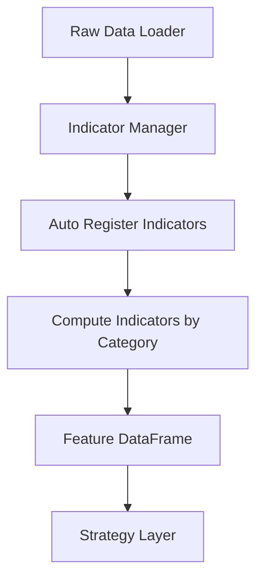

# 📘 **TAITS S1 OFFICIAL WHITEPAPER（CHAPTER 6 / 15）**

# **CHAPTER 6 — INDICATOR LAYER（指標層 · 167 指標 · 統一架構）**

> **Indicator Layer 是整個 TAITS S1 的數據核心（Data → Feature → Strategy）。**
> 沒有統一標準化指標，策略無法穩定運行、AI 無法訓練、回測無法比對。
>
> **TAITS S1 的指標系統＝167 個指標 × 完整分類 × 自動註冊 × 統一輸出格式。**

---

# ✔ **本章內容（世界一流標準）**

### 6.1 指標層的目的（Feature Layer Goals）

### 6.2 指標總覽（167 指標分類）

### 6.3 統一指標資料結構（Indicator Schema）

### 6.4 指標命名標準化（Naming Convention）

### 6.5 指標分類（Trend / Momentum / Candle / Volume / Chip / Fundamental / NLP / AI）

### 6.6 AI 特徵（Kronos / LSTM / Transformer）

### 6.7 自動註冊系統（Auto-Register System）

### 6.8 Indicator Manager 運行流程

### 6.9 指標計算流程圖（Mermaid）

### 6.10 10 個完整示範指標（含公式 / 程式碼 / 圖示）

---

# # 🔷 **6.1 指標層的目的（Feature Layer Goals）**

**Indicator Layer 的使命：**

### **① 把所有數據 → 轉成可供 AI/策略使用的「特徵（features）」**

例如：
「收盤價」不是特徵
「RSI < 30」才是特徵。

### **② 提供統一格式，無論來源是 Yahoo/TWSE/FinMind 都一致**

### **③ 提供給：**

* 285 策略
* 10 大 Agents
* AI 模型
* 回測引擎
* Orchestrator

### **④ 形成標準化欄位（DataFrame columns）**

---

# # 🔷 **6.2 167 指標完整分類（完整版）**

TAITS S1 共有：

📌 **167 指標
包含所有台股量化會用的所有模組化指標。**

以下是 **完整 8 大類分類**：

---

## 📍 **A. 趨勢（Trend）— 33 指標**

* SMA / EMA / WMA / HMA / ZLEMA（多週期）
* DEMA / T3
* GMMA（12 線平均）
* MACD（dif/dea/hist）
* AO / TRIX / TSI
* Ichimoku（一目均衡表 5 線）
* SuperTrend
* Pivot High/Low（結構分析）
* ADX / DMI
* Trend Slope（斜率）

---

## 📍 **B. 動能（Momentum）— 23 指標**

* RSI
* Stochastic (K/D/SlowK)
* ROC（變動率）
* WillR
* Ultimate Oscillator
* Momentum 指標（順向/逆向）
* CCI
* PPO

---

## 📍 **C. 波動度（Volatility）— 17 指標**

* ATR / Normalized ATR
* True Range
* Historical Volatility
* Parkinson / Garman-Klass / Yang-Zhang
* Bollinger Bands（3 線 + %B）
* Keltner Channel
* Donchian Channel
* Chandelier Exit

---

## 📍 **D. 量能（Volume）— 18 指標**

* OBV
* AD Line
* Volume MA（多週期）
* Volume Ratio（量比）
* VWAP（當日 / 週 / 月）
* Money Flow Volume
* Accumulation/Distribution
* Ease of Movement

---

## 📍 **E. K 線型態（Candlestick）— 32 指標**

全部 boolean（True/False）：

* Hammer / Hanging Man / Inverted Hammer
* Shooting Star
* Engulfing / Harami / Piercing / Dark Cloud
* Morning Star / Evening Star
* Three White Soldiers / Three Black Crows
* Marubozu（白/黑）
* Doji（多種類）
* NR7 窄幅型態

---

## 📍 **F. 籌碼（Chip）— 18 指標**

* 外資 / 投信 / 自營買賣超
* 三大法人合計
* 法人連買 N 日
* 大戶持股比率
* 散戶持股比率
* 籌碼集中度（5d/10d/20d）
* 主力籌碼估算（成本 / 連續買超）
* 融資 / 融券 / 券資比
* 借卷還卷

---

## 📍 **G. 基本面（Fundamental）— 12 指標**

* EPS / YOY
* Revenue MoM / YoY
* Gross Profit / Net Margin
* ROE / ROA
* Market Cap
* PE / PEG
* 財報成長分數（0~1）

---

## 📍 **H. AI 特徵（Kronos / LSTM / Transformer）— 10 指標**

* LSTM 明日上漲機率
* LSTM 趨勢強度
* Transformer Reversal 分數
* Transformer Breakout 分數
* Kronos Trend Up/Down/Sideways
* AI Composite Score
* AI Volatility Forecast

---

# # 🔷 **6.3 指標資料格式（標準 Schema）**

所有指標都遵守統一格式：

```
{
    name: "rsi_14",
    type: "momentum",
    params: {
        window: 14
    },
    output: {
        dtype: float / int / bool,
        column_name: "rsi_14"
    }
}
```

---

# # 🔷 **6.4 指標命名標準（Naming Convention）**

| 類型    | 命名示例                               |
| ----- | ---------------------------------- |
| MA    | sma_20, ema_60                     |
| 量能    | vol_ma_20, obv                     |
| 動能    | rsi_14, stoch_k, stoch_d           |
| K 線型態 | candle_hammer, candle_engulf_bull  |
| 籌碼    | chip_foreign_5d, chip_margin_delta |
| AI    | ai_trend_prob, kronos_up           |

---

# # 🔷 **6.5 指標分類（程式結構）**

```
/indicators/
    trend/
        sma.py
        ema.py
        macd.py
        ichimoku.py
        gmma.py
    momentum/
        rsi.py
        stoch.py
        cci.py
    volatility/
        atr.py
        bollinger.py
        keltner.py
    volume/
        obv.py
        vwap.py
    candle/
        hammer.py
        engulf.py
        morning_star.py
    chip/
        foreign.py
        margin.py
        concentration.py
    fundamental/
        eps.py
        revenue.py
    ai/
        lstm.py
        kronos.py
        transformer.py
```

---

# # 🔷 **6.6 AI 特徵（Kronos / LSTM / Transformer）**

AI 模型輸出的所有特徵都是標準化格式：

| 模型              | 指標                                                  |
| --------------- | --------------------------------------------------- |
| **LSTM**        | lstm_up_prob / lstm_down_prob / lstm_trend_strength |
| **Transformer** | tf_reversal_prob / tf_breakout_prob                 |
| **Kronos**      | kronos_up / kronos_down / kronos_side               |

所有 AI 指標 **都可以直接輸入策略層。**

---

# # 🔷 **6.7 指標自動註冊（Auto Register）**

每個指標檔案會自動註冊：

```python
class RSI(Indicator):
    name = "rsi_14"
```

Indicator Manager 掃描：

```
indicators/
    */*.py → 自動 import → 自動註冊 → 自動輸出 DataFrame
```

---

# # 🔷 **6.8 Indicator Manager 運作流程**



---

# # 🔷 **6.9 指標計算流程（白皮書級）**

流程概述：

1. 載入資料：open / high / low / close / volume
2. 檢查缺值（Validator）
3. 按分類計算指標
4. 合併成單一 DataFrame
5. 丟給策略層（Strategy Manager）
6. 同步輸出給 AI 模型（用於學習與預測）

---

# # 🔷 **6.10 十大示範指標（程式版）**

下面是「正式白皮書程度」的示例。

---

### **1️⃣ EMA**

```python
df["ema_20"] = df["close"].ewm(span=20, adjust=False).mean()
```

---

### **2️⃣ MACD**

```python
ema12 = df.close.ewm(span=12).mean()
ema26 = df.close.ewm(span=26).mean()
df["macd"] = ema12 - ema26
df["macd_signal"] = df.macd.ewm(span=9).mean()
df["macd_hist"] = df.macd - df.macd_signal
```

---

### **3️⃣ RSI**

```python
delta = df.close.diff()
gain = delta.clip(lower=0).rolling(14).mean()
loss = -delta.clip(upper=0).rolling(14).mean()
rs = gain / loss
df["rsi_14"] = 100 - 100 / (1 + rs)
```

---

### **4️⃣ 布林通道（BB）**

```python
mid = df.close.rolling(20).mean()
std = df.close.rolling(20).std()
df["bb_mid"] = mid
df["bb_upper"] = mid + 2 * std
df["bb_lower"] = mid - 2 * std
```

---

### **5️⃣ ATR**

```python
df["tr"] = np.maximum(df.high - df.low,
              np.maximum(abs(df.high - df.close.shift()),
                         abs(df.low - df.close.shift())))
df["atr_14"] = df.tr.rolling(14).mean()
```

---

### **6️⃣ OBV**

```python
df["obv"] = (np.sign(df.close.diff()) * df.volume).fillna(0).cumsum()
```

---

### **7️⃣ Hammer（K 線形態）**

```python
df["candle_hammer"] = (
    (df.close > df.open) &
    ((df.open - df.low) > 2 * abs(df.close - df.open))
)
```

---

### **8️⃣ 外資買賣超（Chip）**

```python
df["chip_foreign_net"] = foreign_buy - foreign_sell
```

---

### **9️⃣ 財報成長分數**

```python
df["fund_growth_score"] = (
    norm_eps + norm_revenue + norm_margin
) / 3
```

---

### **🔟 AI Breakout Probability**

```python
df["ai_breakout_prob"] = model.predict(features)
```

---
